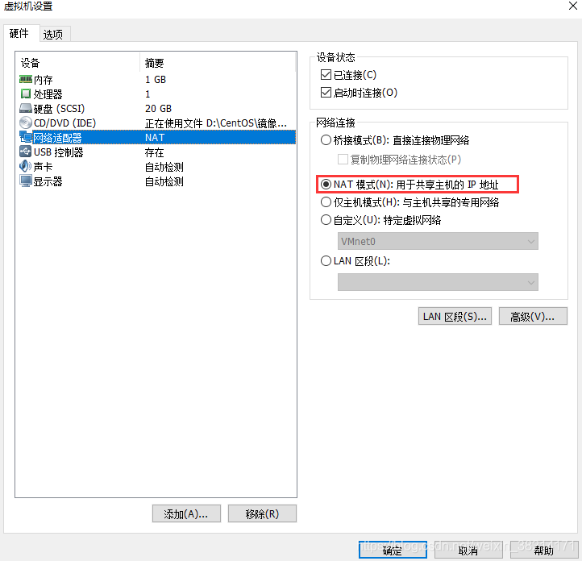
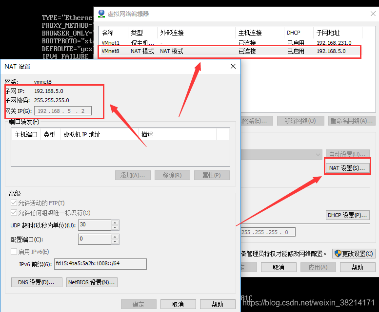
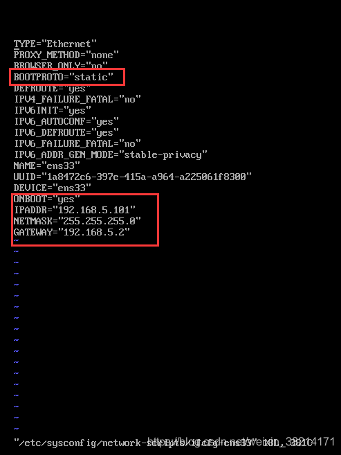

**尝试ping**
```shell
    ping www.daidu.com
```

## 一、需要把虚拟机的网络连接设置为"NAT模式"


## 二、选择VMWare的NAT模式


*记住NAT设置中的子网IP、子网掩码、网关IP三项，接下来配置文件主要是这三项。*

## 三、编辑网络配置文件
```shell
    vi /etc/sysconfig/network-scripts/ifcfg-ens33

    # ifcfg-ens33根据个人安装不同
```


## 四、我的DNS配置
```shell
    vi /etc/resolv.conf
```


## 五、查看ip
```shell
    ip addr
```

## 六、重启网络
```shell
    service network restart 
```

**最后**
`ping www.baidu.com`